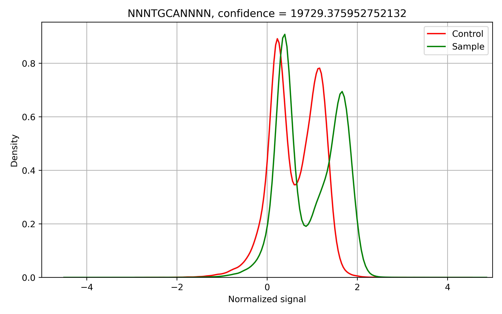
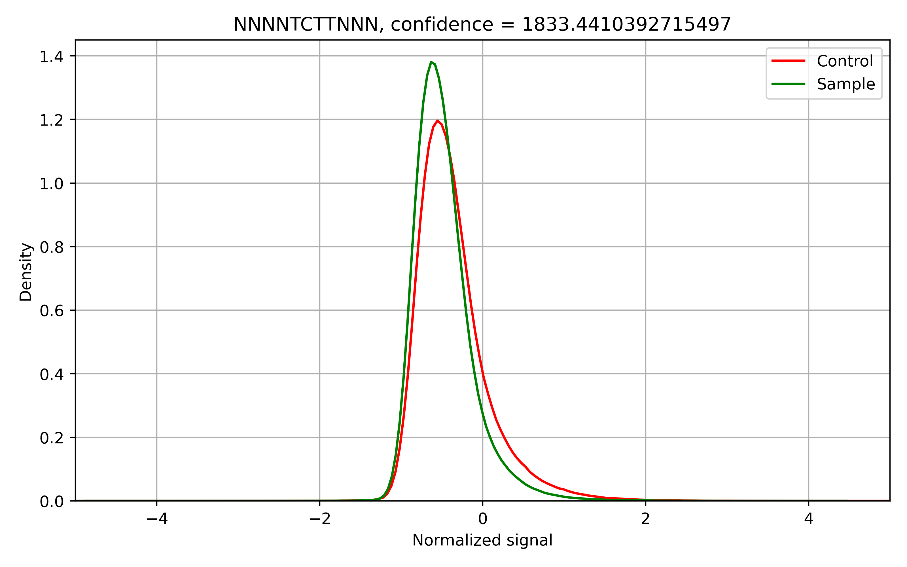
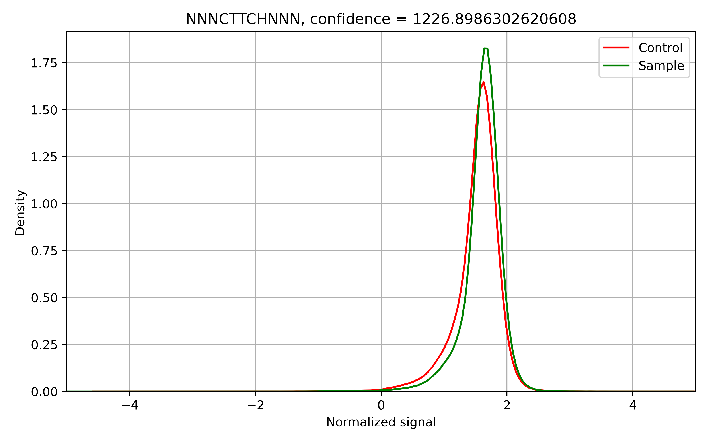
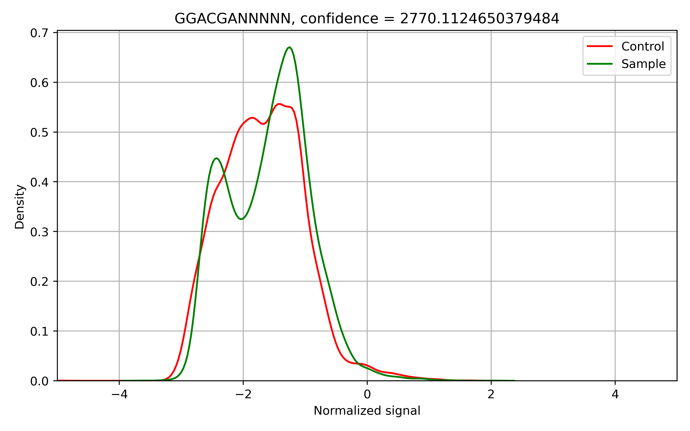
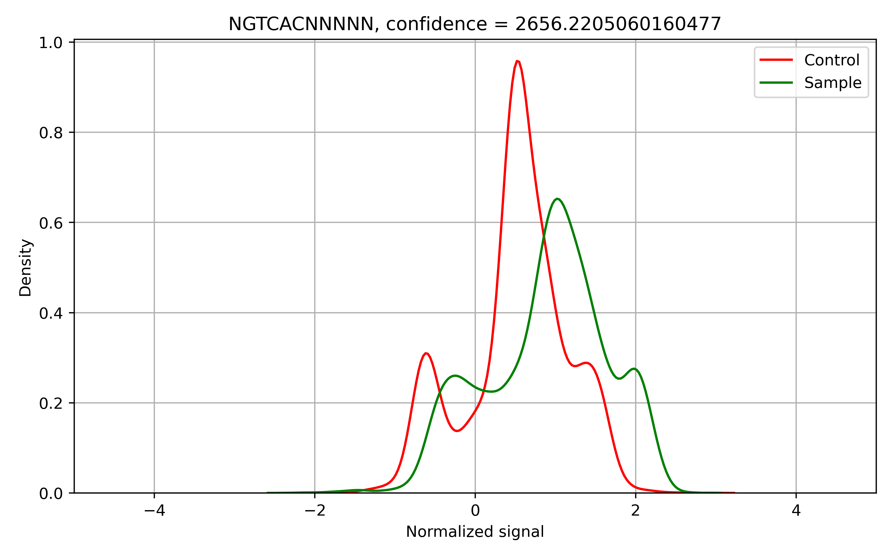
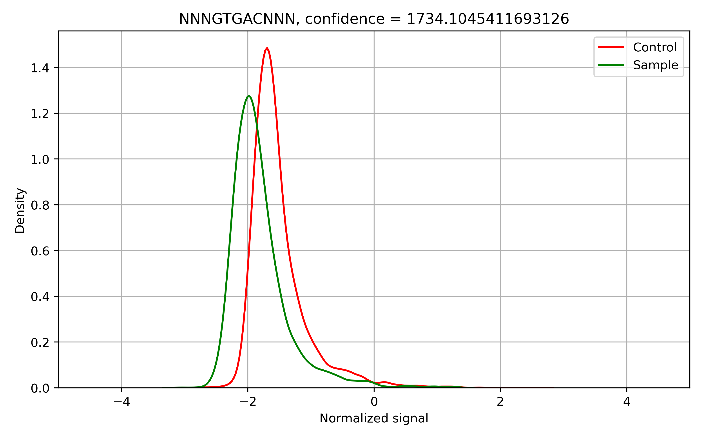
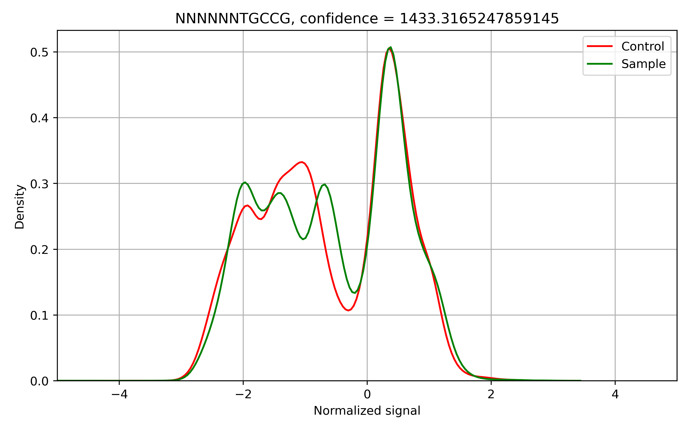

Usercases
=========

*Helicobacter pylori* A45 total methylome analysis
--------------------------------------------------

In this example, we will use Snapper for the total methylaome analysis of *Helicobacter pylori* A45 strain.

The running command::

    (snapper) $ snapper -sample_fast5dir A45_multi -control_fast5dir A45_wga_multi -reference assembly_A45.fna -threads 16 -target_chr NZ_CP053256.1 -max_motifs 30 -outdir Results_A45  

Here we set ``-max_motifs`` parameter to be 30 since *H. pylori* is known to have a huge number of different R-M systems (up to 30).
In addition, we specified ``-target_chr`` parameter to analyze only the main chromosome.

The first stage of the pipeline is raw signals collecting. It might up to one hour depending on the dataset size. 
On average, a dataset consisting of 40-50 multifast5 batches is processed not longer than in 15-20 minutes.

.. code:: console

    Sample data collecting...
    Batch 1 out of 40...
    Batch 2 out of 40...
    # and so on...

    
    Control data collecting...
    Batch 1 out of 40...
    Batch 2 out of 40...
    # and so on...

Next, the algorithm performs the Kolmogorov-Smirnov test to compare signal distributions for each 11-mer presented in the reference genome.

.. code:: console

    Forward strand signals processing...
    Getting difsignals...
    NZ_CP053256.1: 578090 out of 912990...
    ...

Since all 11-mers that have significant signal shift have been extracted, they are written to the ``passed_motifs_{}.fasta`` file.

The next stage is a greedy motif extraction. In the console output, we can see the motif variant extracted on each algorithm iteration.
For each motif, the algorithm checks if this motif should be merged with some of the motifs found on the previous iterations, which also can bee seen 
in the console output::

    ITERATION 1 (55714 unexplained 11mers):
            OBSERVING MOTIFS WITH LENGTH OF 4
            OBSERVING MOTIFS WITH LENGTH OF 5
            OBSERVING MOTIFS WITH LENGTH OF 6
            Motif adjustment...
            Motif adjustment...
    (32929.810579835554, ('N', 'C', 'A', 'T', 'G', 'N'), (2, 3, 4, 5, 6, 7))
    # the first extracted motif is NCATGN located from 2nd to 7th position in the 11-mer context
    ['NCATGN']
    # just before the next iteration, the current set of potential methylation motifs is shown
    ITERATION 2 (51145 unexplained 11mers):
            OBSERVING MOTIFS WITH LENGTH OF 4
            OBSERVING MOTIFS WITH LENGTH OF 5
            OBSERVING MOTIFS WITH LENGTH OF 6
            Motif adjustment...
            Motif adjustment...
    (27150.172723009397, ('N', 'G', 'C', 'G', 'C', 'N'), (2, 3, 4, 5, 6, 7))
    ['NCATGN', 'NGCGCN']
    # one more motif was added to the methylation motifs set
    ITERATION 3 (47632 unexplained 11mers):
            OBSERVING MOTIFS WITH LENGTH OF 4
            OBSERVING MOTIFS WITH LENGTH OF 5
            OBSERVING MOTIFS WITH LENGTH OF 6
            Motif adjustment...
            Motif adjustment...
    (25455.630042353463, ('N', 'C', 'A', 'T', 'G', 'N'), (3, 4, 5, 6, 7, 8))
    (25455.630042353463, ('N', 'C', 'A', 'T', 'G', 'N'), (3, 4, 5, 6, 7, 8)) already has a supermotif!
    Changed to (None, ('N', 'C', 'A', 'T', 'G', 'N'), (3, 4, 5, 6, 7, 8))
    # here, we can see that a new extracted motif NCATGC located form 3rd to 8th position in 11mers is a duplicate,
    # or, more generally, has a supermotif in the current motifs set. The algorithm modifies this motif according to the
    # corresponding supermotif, extract it, and goes to the next iteration

    ['NCATGN', 'NGCGCN']
    # here, the motifs set has not been changed
    ITERATION 4 (44097 unexplained 11mers):
        ...

When the algorithm extracts the desired number of motifs (in our case it equals 30) or reaches the limit of confidence level (in our case we used the default value equals 1000), 
it stops, and all the extracted motifs are written to the ``final_motifs_{}.fasta`` file. You can see the file that we obtained for *H. pylori* A45 below.

.. code:: console

    >MOTIF_1 conflevel=32929.810579835554
    NCATGN
    >MOTIF_2 conflevel=27150.172723009397
    NGCGCN
    >MOTIF_3 conflevel=20926.64815874996
    NTGCAN
    >MOTIF_4 conflevel=16871.401882032533
    NGAACN
    >MOTIF_5 conflevel=15530.496289015375
    NGGCCN
    >MOTIF_6 conflevel=13946.47111908573
    NGATCN
    >MOTIF_7 conflevel=14357.456320775802
    NCCAGN
    >MOTIF_8 conflevel=13564.339781476972
    TGCAAN
    >MOTIF_9 conflevel=13897.42649049243
    NCCATCN
    >MOTIF_10 conflevel=13516.073689850868
    NGANTCN
    >MOTIF_11 conflevel=11834.003594825455
    TCNNGAN
    >MOTIF_12 conflevel=10879.027264923401
    ATTAATN
    >MOTIF_13 conflevel=11125.493295859182
    NGGGGAN
    >MOTIF_14 conflevel=10321.761783741122
    NTCNGAN
    >MOTIF_15 conflevel=6055.761315478015
    NGGAGAN
    >MOTIF_16 conflevel=5151.606515517744
    GTNNACN
    >MOTIF_17 conflevel=3797.0776895320637
    NTCGAN

The authors recommend to check the motif correctness mannually in cases when its confidence level lower than 3000. 
In this particular case, all the extracted motifs had a sufficient confidence level, so, they can be used as is.

In addition to text output, Snapper generates signal distribution plots for each extracted motif. These plots can be found in ``plots_[forward, reverse]_[contigname]`` folders. Let's observe some signal distributions:

.. image:: images/A45_NNNCATGNNNN.png

.. image:: images/A45_ATTAATNNNNN.png

Here, we can see few typical types of signal distribution. The first CATG motif distribution has a clear unimodal shape and visible signal shift, 
while the second motif TGCA has two modes. Note, that shift size can differ for different modes. The last plot demonstrates longer ATTAAT methylation site. 
Here, despite a high effect size, the confidence level is quite low. The reason is a formal length of the motif since longer motifs are just rarer than shorter ones, 
so, the statistics values tend to be lower too. Generally, the author recommend to be cautios with motifs that have confidince level lower than 3000 regardless of the motif length.

*Helicobacter pylori* A45 native vs mutant analysis
---------------------------------------------------

In the previous example, we generated a list of potential H.pylori A45 methylation sites, and few of them has not been described earlier (such as CCAG, GAAC and GGRGA).

In this example, we will use Snapper for the analysis of H. pylori A45 mutant knocked-out on a gene encoding a methyltransferase with unknown specificity 
in order to confirm a new MTase experimentally. So, in contrast to the previous case, we expect to see only one motif that has a significant signal shift in comparison with the wild type.

The running command::

    (snapper) $ snapper -sample_fast5dir A45_multi -control_fast5dir A45_newmut_multi -reference A45.fna -outdir Results_A45_newmut 

Unexpectedily, the resulting list of motifs includes three motifs::

    >MOTIF_1 conflevel=69232.936179688
    NCCAGN
    >MOTIF_2 conflevel=1833.4410392715497
    NTCTTN
    >MOTIF_4 conflevel=1226.8986302620608
    NCTTCH

According to these results, the new MTase is most likely specific to CCAG site, but there are two motifs with confidence level lower than 3000 were extracted. 
Since the algorithm implemented in Snapper is very high-sensitive, these results seem to be false-positive. Let's consider corresponding signal distributions in order to confirm our inference:

.. image:: images/bc13_NNNCCAGNNNN.png
    

    

Indeed, the CCAG motif has a visible signal shift, while the others have a very small difference between native and contol samples. 
Moreover, these two motifs cannot be merged into one “ancestor” motif. Combining it with small effect size and low confidince level, we can conclude that these motifs are false-positive.

When motifs with low confidence level are not false-positive?
-------------------------------------------------------------

Let's consider other case opposite to the previous. Here, we will analyze another *H. pylori* strain J99. The Snapper resulting file had the following motifs with low confidence level::

    ...
    >MOTIF_5 conflevel=13377.13156417874
    NCCGGN
    ...
    >MOTIF_13 conflevel=5502.44744861762
    NGGNCTAN
    >MOTIF_14 conflevel=5544.476242630171
    NGGWCAAN
    ...
    >MOTIF_16 conflevel=4384.303493212003
    NCGACGN
    >MOTIF_17 conflevel=4242.870880053313
    NCGTCGN
    ...
    >MOTIF_20 conflevel=2770.1124650379484
    GGACGAN
    >MOTIF_21 conflevel=2656.2205060160477
    NGTCACN
    >MOTIF_22 conflevel=1734.1045411693126
    NGTGACN
    >MOTIF_23 conflevel=1718.0747564787976
    GTCNATN
    >MOTIF_25 conflevel=1551.2644823054413
    CGTCGTN
    >MOTIF_26 conflevel=1433.3165247859145
    NTGCCG

Firstly, we can remove from this list GTCNATN because it did not show a visible signal shift on the plot. 
Secondly, CGTCGTN should be removed since it is just a submotif of NCGWCGN that had a confidence score greater than 3000 (NCGACGN and NCGTCGN motifs in the list above). 
Now, let's consider signal distributions for other motifs:

    

Firstly, we can see that both GTGAC and GTCAC motifs have a clear signal shift and can be merged into one GTSAC motif. 
So, combining these two facts, despite the low value of confidence, we can conclude that GTSAC methylation motif is presented in this strain.

The NTGCCG motif seems partially shifted but the two distributions have one identical mode. Usually, it means that the complete motif sequence has not been extracted 
or the motif context has not been successfully adjusted due to 11-mers length limitation. Actually, in this particular case, this motif is just cropped form of CCGG motif. 
We should note, that CCGG was extracted individually with confidence greater than 10000.

The GGACGAN motif looks the most controversial. The change in the distribution shape signalizes about the presence of a methylated base in this context, 
but we cannot be sure about motif correctness or motif completeness. The only additional thing we know is that this motif is 
quite similar to GGNCTA and GGWCAA that had a satisfactory confidence level. Maybe they are formed by one common ancestor motif, 
but formally, such cases can be resolved only experimentally.