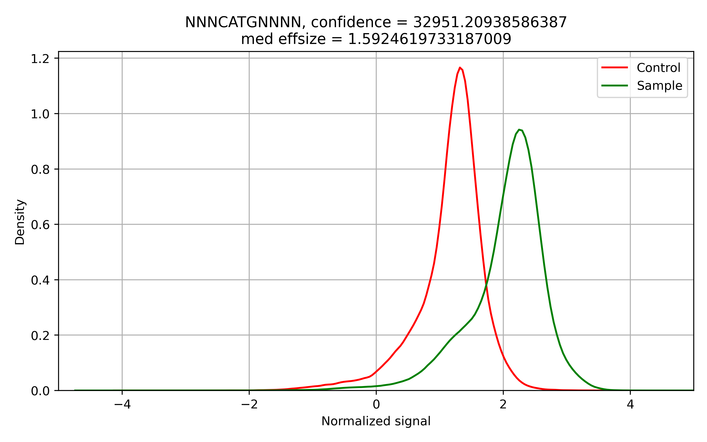
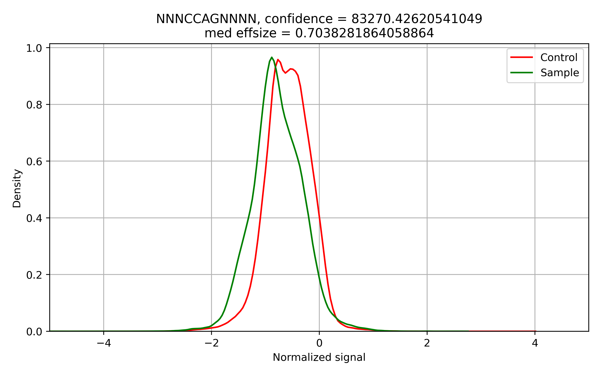

Usercases
=========

*Helicobacter pylori* A45 total methylome analysis
--------------------------------------------------

In this example, we will use Snapper for the total methylaome analysis of *Helicobacter pylori* A45 strain.

The running command::

    (snapper) $ snapper -sample_fast5dir A45_multi -control_fast5dir A45_wga_multi -reference assembly_A45.fna -threads 16 -target_chr NZ_CP053256.1 -max_motifs 30 -outdir Results_A45  

Here we set ``-max_motifs`` parameter to be 30 since *H. pylori* is known to have a huge number of different R-M systems (up to 30).
In addition, we specified ``-target_chr`` parameter to analyze only the main chromosome.

The first stage of the pipeline is raw signals collecting. It might take up to one hour depending on the dataset size. 
On average, a dataset consisting of 40-50 multifast5 batches is processed not longer than in 15-20 minutes.

.. code:: console

    Sample data collecting...
    Batch 1 out of 40...
    Batch 2 out of 40...
    # and so on...

    
    Control data collecting...
    Batch 1 out of 40...
    Batch 2 out of 40...
    # and so on...

Next, the algorithm performs the Kolmogorov-Smirnov test to compare signal distributions for each 11-mer presented in the reference genome.

.. code:: console

    Forward strand signals processing...
    Getting difsignals...
    NZ_CP053256.1: 578090 out of 912990...
    ...

Just after all 11-mers that have significant signal shift have been extracted, they are written to the ``passed_motifs_{}.fasta`` file.

The next stage is a greedy motif extraction. In the console output, we can see the motif variant extracted on each algorithm iteration.
For each motif, the algorithm checks if this motif should be merged with some of the motifs found on the previous iterations, which also can bee seen 
in the console output::

    ITERATION 1 (55714 unexplained 11mers):
            OBSERVING MOTIFS WITH LENGTH OF 4
            OBSERVING MOTIFS WITH LENGTH OF 5
            OBSERVING MOTIFS WITH LENGTH OF 6
            Motif adjustment...
            Motif adjustment...
    (32929.810579835554, ('N', 'C', 'A', 'T', 'G', 'N'), (2, 3, 4, 5, 6, 7))
    # the first extracted motif is NCATGN located from 2nd to 7th position in the 11-mer context
    ['NCATGN']
    # just before the next iteration, the current set of potential methylation motifs is shown
    ITERATION 2 (51145 unexplained 11mers):
            OBSERVING MOTIFS WITH LENGTH OF 4
            OBSERVING MOTIFS WITH LENGTH OF 5
            OBSERVING MOTIFS WITH LENGTH OF 6
            Motif adjustment...
            Motif adjustment...
    (27150.172723009397, ('N', 'G', 'C', 'G', 'C', 'N'), (2, 3, 4, 5, 6, 7))
    ['NCATGN', 'NGCGCN']
    # one more motif was added to the methylation motifs set
    ITERATION 3 (47632 unexplained 11mers):
            OBSERVING MOTIFS WITH LENGTH OF 4
            OBSERVING MOTIFS WITH LENGTH OF 5
            OBSERVING MOTIFS WITH LENGTH OF 6
            Motif adjustment...
            Motif adjustment...
    (25455.630042353463, ('N', 'C', 'A', 'T', 'G', 'N'), (3, 4, 5, 6, 7, 8))
    (25455.630042353463, ('N', 'C', 'A', 'T', 'G', 'N'), (3, 4, 5, 6, 7, 8)) already has a supermotif!
    Changed to (None, ('N', 'C', 'A', 'T', 'G', 'N'), (3, 4, 5, 6, 7, 8))
    # here, we can see that a new extracted motif NCATGC is a duplicate,
    # or, more generally, has a supermotif in the current motifs set. The algorithm modifies this motif according to the
    # corresponding supermotif, extracts it, and goes to the next iteration

    ['NCATGN', 'NGCGCN']
    # here, the motifs set has not been changed
    ITERATION 4 (44097 unexplained 11mers):
        ...

When the algorithm extracts the desired number of motifs (in our case it equals 30) or reaches the limit of confidence level (in our case we used the default value equals 1000), 
it stops. The results include the generated list of potential methylation sites, where for each motif a corresponding confidence level and signal shift size are calculated. 
The table below shows the results returned by Snapper for *H. pylori* A45.

+-------+-----------+---------+
| MOTIF | conflevel | effsize |
+=======+===========+=========+
|NCATGN | 32951.2   | 1.59    |
+-------+-----------+---------+
|NGCGCN |32109.6    | 1.11    |
+-------+-----------+---------+
|NTGCAN | 19535.3   |   1.00  |
+-------+-----------+---------+
|NGAACN | 21296.2   |0.79     |
+-------+-----------+---------+
|NGGCCN |22838.8    | 1.42    |
+-------+-----------+---------+
|NGATCN | 24323.8   | 0.46    |
+-------+-----------+---------+
|NCCAGN | 22631.8   |0.72     |
+-------+-----------+---------+
|NCCATCN|29952.0    |1.54     |
+-------+-----------+---------+
|NGAHTCN|25034.2    |0.72     |
+-------+-----------+---------+
|NGGGGAN|14548.9    |0.58     |
+-------+-----------+---------+
|ATTAATN|16256.6    |1.26     |
+-------+-----------+---------+
|TCNNGAN|16322.6    |0.63     |
+-------+-----------+---------+
|NTCNGAN|18074.7    | 0.63    |
+-------+-----------+---------+
|NGANTC | 11994.4   |0.37     |
+-------+-----------+---------+
|NGGAGAN|11128.4    | 0.60    |
+-------+-----------+---------+
|GTNNACN|9591.0     | 0.92    |
+-------+-----------+---------+
|NTCGAN |4558.2     |0.62     |
+-------+-----------+---------+
|CNNGAN | 3066.5    | 0.27    |
+-------+-----------+---------+

Generally, motifs with confidence level higher than 5000 might be used without additional verification regardless effect size. Thus, the NGATCN motif (actually just GATC) has a moderate 
signal shift (effsize < 0.5) but extremely high confidence level that indicates about motif correctness. In contrast, the NTCGAN motif has quite low confidence level but high effect size greater than 0.5, 
that seems satisfactory for motif inference. The last extracted motif CNNGAN has the lowest confidence and effect size. To ensure the motif correctness we should consider corresponding signal distribution plots.

We can see that signal distributions are quite similar and contain a few common modes. Let's compare this plot with actual *H. pylori* methylation sites:

Indeed, the effect size should be noticeable for actual individual methylation sites, so we can conclude that CNNGA is not an individual motif. Actually, it is just a submotif for the TCNNGA motif.

We should mention that Snapper is intentionally does not merge close motifs such as GGGGA and GGAGA to prevent occasional motif collisions, so the user should to merge these variants by themselves.
Combining the Snapper results, we can infer the following list of methylation sites: ATTAAT, GTNNAC, GGRGA, CCATC, CATG, CCAG, GCGC, GANTC, GATC, GGCC, GAAC, TGCA, TCGA, TCNGA, TCNNGA. 

*Helicobacter pylori* A45 native vs mutant analysis
---------------------------------------------------

In the previous example, we inferred a list of potential *H.pylori* A45 methylation sites, and few of them has not been described earlier (such as CCAG, GAAC and GGRGA).

In this example, we will use Snapper for the analysis of *H. pylori* A45 mutant disrupted in a gene encoding a methyltransferase with unknown specificity 
in order to confirm a new MTase experimentally. So, in contrast to the previous case, we expect to see only one motif that has a significant signal shift in comparison with the wild type.

The running command::

    (snapper) $ snapper -sample_fast5dir A45_multi -control_fast5dir A45_newmut_multi -reference A45.fna -outdir Results_A45_newmut 

Unexpectedily, the resulting list of motifs includes two motifs:

+-------+-----------+---------+
| MOTIF | conflevel | effsize |
+=======+===========+=========+
|NCAGGN | 83270.4   | 0.70    |
+-------+-----------+---------+
|NTCTN  | 3174.7    | 0.32    |
+-------+-----------+---------+

According to these results, the considered MTase is most likely specific to CCAG site, but there is one motif with confidence level lower than 3000 was extracted. 
Since the algorithm implemented in Snapper is very high-sensitive, these results seem to be false-positive. Let's consider corresponding signal distributions in order to confirm our inference:

    

Indeed, the CCAG motif has a visible signal shift, so it is most likely to be the metylation site for the considered MTase. At the same time, TCT has a very small but noticeable difference between native and contol samples in both distribution modes.
Probably, TCT is part of Type I R-M system recognition site but it requires additional experimental confirmation.

When motifs with low confidence level are not false-positive?
-------------------------------------------------------------

Let's consider other case opposite to the previous. Here, we will analyze another *H. pylori* strain J99. Snapper returned the following motifs:

 
+-------+-----------+---------+
| MOTIF | conflevel | effsize |
+=======+===========+=========+
|NCATGN | 30725.1   | 1.30    |
+-------+-----------+---------+
|NGCGCN |31789.6    | 0.85    |
+-------+-----------+---------+
|NGATCN | 28787.6   |   0.36  |
+-------+-----------+---------+
|NGANTCN| 18370.6   |0.4      |
+-------+-----------+---------+
|NCCGGN |16504.4    | 0.98    |
+-------+-----------+---------+
|NGCCTAN| 18232.3   | 1.32    |
+-------+-----------+---------+
|NGACAY | 12090.2   |1.12     |
+-------+-----------+---------+
|NGTCATN|12902.7    |1.33     |
+-------+-----------+---------+
|NACGTN |10060.5    |1.07     |
+-------+-----------+---------+
|NCCNNGG|8993.5     |0.74     |
+-------+-----------+---------+
|NGAGGN |8984.4     |0.28     |
+-------+-----------+---------+
|ATTAATN|10246.2    |0.96     |
+-------+-----------+---------+
|GGWCWAN|10589.9    | 0.55    |
+-------+-----------+---------+
|GGWCNAN| 9547.2    |0.46     |
+-------+-----------+---------+
|NGTACN |7495.2     | 1.07    |
+-------+-----------+---------+
|NCGACGN|6267.5     | 1.02    |
+-------+-----------+---------+
|NCGTCGN|5088.5     |0.51     |
+-------+-----------+---------+
|NTCGAN | 4788.8    | 0.44    |
+-------+-----------+---------+
|CCTAAN | 4838.8    | 0.16    |
+-------+-----------+---------+
|GGGCTAN| 4508.5    | 0.33    |
+-------+-----------+---------+
|NGTCACN| 3847.4    | 1.11    |
+-------+-----------+---------+
|NTNCCG | 2365.1    | 0.15    |
+-------+-----------+---------+
|NGTGACN| 2307.4    | 0.67    |
+-------+-----------+---------+
|GTCNATN| 2309.9    | 0.19    |
+-------+-----------+---------+
|GACNAN | 2326.3    | 0.13    |
+-------+-----------+---------+
|NCCNGG | 1977.4    | 0.25    |
+-------+-----------+---------+
|GGGCNAN| 1261.5    | 0.17    |
+-------+-----------+---------+

This case is quite more complicated compared with the previous since case there is more potential motifs with low metric values which should 
be filtered manually. Fortunately, combining confidence level with observed effect size we can infer individual motifs.
Firstly, we should remove from the list all motifs that have confidence level lower than 3000 AND effect size lower than 0.25 (NTNCCG, GTCNATN, GACNAN, NCCNGG, GGGCNAN).
As well as in the previous case, all motifs with confidence level greater than 5000 can be used as is regardless the effect size. NGTCACN and NGTGACN motifs has quite low 
confidence level but a solid signal shift and form an ancestor motif GTSAC.

NTCGAN and GGGTCAN are more controversial. They both have a moderate signal shift and confidence level, so we should manually observe corresponding signal destributions to
verify their presence.

    

Control and sample signal distributions for GGGCTA have a common mode that indicates that it is not an individual motif while TCGA has a visible signal shift, so we
can conlude that TCGA is an individual motif.

Main points
-----------

Here, we summurize some motif inference recommendations: 

1. Generally, if the confidence level of a considered motif is greater than 5000, it is most probably an individual motif regardless signal shift size.
2. Generally, if the signal shift (effsize) of a considered motif is greater than 0.5, it is most probably an individual motif.
3. If some motif has a confidence level lower than 5000 and a signal shift lower than 0.5, it should be manually verified via corresponding signal distributions plots observation. If sample and control distributions have a common mode (one ore more), it usually indicates that motif sequence is incomplete.
4. If some motif has a confidence level lower than 3000 and a signal shift lower than 0.25, it is most likely not to be an individual motif.  

Demo-dataset
------------

The demo-dataset is available on our FTP: `http://download.ripcm.com/snapper_test/ <http://download.ripcm.com/snapper_test/>`_

The demo-dataset includes multi-fast5 files for native *H. pylori* A45 strain (``control`` folder) and *hpy* mutant disrupted in the gene encoding CATG-specific methyltransferase (``mutant`` folder).
The reference genome is available on GenBank: `GCF_000333835.2 <https://www.ncbi.nlm.nih.gov/assembly/GCF_000333835.2/>`_.