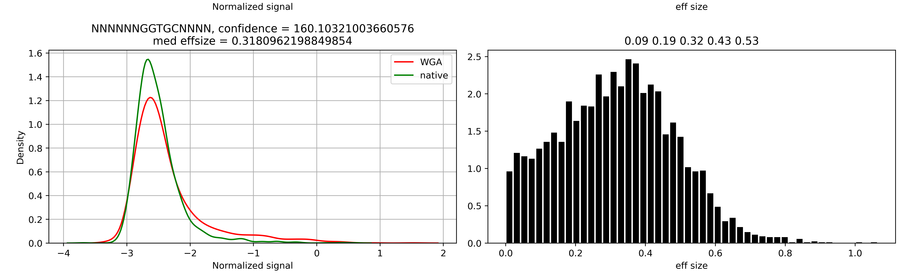

Usercases
=========

*Helicobacter pylori* A45 total methylome analysis
--------------------------------------------------

In this example, we will use Snapper for the total methylome analysis of *Helicobacter pylori* A45 strain.

The running command::

    (snapper) $ snapper -sample_fast5dir A45_multi -control_fast5dir A45_wga_multi -reference assembly_A45.fna -threads 16 -target_chr NZ_CP053256.1 -max_motifs 30 -outdir Results_A45  

Here we set ``-max_motifs`` parameter to be 30 since *H. pylori* is known to have a huge number of different R-M systems (up to 30).
In addition, we specified ``-target_chr`` parameter to analyze only the main chromosome.

The first stage of the pipeline is raw signals collecting. It might take up to one hour depending on the dataset size. 
On average, a dataset consisting of 40-50 multifast5 batches is processed not longer than in 15-20 minutes.

.. code:: console

    Sample data collecting...
    Batch 1 out of 40...
    Batch 2 out of 40...
    # and so on...

    
    Control data collecting...
    Batch 1 out of 40...
    Batch 2 out of 40...
    # and so on...

Next, the algorithm performs the Kolmogorov-Smirnov test to compare signal distributions for each 11-mer presented in the reference genome.

.. code:: console

    Forward strand signals processing...
    Getting difsignals...
    NZ_CP053256.1: 578090 out of 912990...
    ...

Just after all 11-mers that have significant signal shift have been extracted, they are written to the ``passed_motifs_{}.fasta`` file.

The next stage is a greedy motif extraction. In the console output, we can see the motif variant extracted on each algorithm iteration.
For each motif, the algorithm checks if this motif should be merged with some of the motifs found on the previous iterations, which also can bee seen 
in the console output::

    ITERATION 1 (55714 unexplained 11mers):
            OBSERVING MOTIFS WITH LENGTH OF 4
            OBSERVING MOTIFS WITH LENGTH OF 5
            OBSERVING MOTIFS WITH LENGTH OF 6
            Motif adjustment...
            Motif adjustment...
    (32929.810579835554, ('N', 'C', 'A', 'T', 'G', 'N'), (2, 3, 4, 5, 6, 7))
    # the first extracted motif is NCATGN located from 2nd to 7th position in the 11-mer context
    ['NCATGN']
    # just before the next iteration, the current set of potential methylation motifs is shown
    ITERATION 2 (51145 unexplained 11mers):
            OBSERVING MOTIFS WITH LENGTH OF 4
            OBSERVING MOTIFS WITH LENGTH OF 5
            OBSERVING MOTIFS WITH LENGTH OF 6
            Motif adjustment...
            Motif adjustment...
    (27150.172723009397, ('N', 'G', 'C', 'G', 'C', 'N'), (2, 3, 4, 5, 6, 7))
    ['NCATGN', 'NGCGCN']
    # one more motif was added to the methylation motifs set
    ITERATION 3 (47632 unexplained 11mers):
            OBSERVING MOTIFS WITH LENGTH OF 4
            OBSERVING MOTIFS WITH LENGTH OF 5
            OBSERVING MOTIFS WITH LENGTH OF 6
            Motif adjustment...
            Motif adjustment...
    (25455.630042353463, ('N', 'C', 'A', 'T', 'G', 'N'), (3, 4, 5, 6, 7, 8))
    (25455.630042353463, ('N', 'C', 'A', 'T', 'G', 'N'), (3, 4, 5, 6, 7, 8)) already has a supermotif!
    Changed to (None, ('N', 'C', 'A', 'T', 'G', 'N'), (3, 4, 5, 6, 7, 8))
    # here, we can see that a new extracted motif NCATGC is a duplicate,
    # or, more generally, has a supermotif in the current motifs set. The algorithm modifies this motif according to the
    # corresponding supermotif, extracts it, and goes to the next iteration

    ['NCATGN', 'NGCGCN']
    # here, the motifs set has not been changed
    ITERATION 4 (44097 unexplained 11mers):
        ...

When the algorithm extracts the desired number of motifs (in our case it equals 30) or reaches the limit of confidence level (in our case we used the default value equals 1000), 
it stops. The results include the generated list of potential methylation sites, where for each motif a corresponding confidence level and signal shift size are calculated. 
The table below shows the results returned by Snapper for *H. pylori* A45.

+-------+-----------+---------+
| MOTIF | conflevel | effsize |
+=======+===========+=========+
|NCATGN | 32951.2   | 1.59    |
+-------+-----------+---------+
|NGCGCN |32109.6    | 1.11    |
+-------+-----------+---------+
|NTGCAN | 19535.3   |   1.00  |
+-------+-----------+---------+
|NGAACN | 21296.2   |0.79     |
+-------+-----------+---------+
|NGGCCN |22838.8    | 1.42    |
+-------+-----------+---------+
|NGATCN | 24323.8   | 0.46    |
+-------+-----------+---------+
|NCCAGN | 22631.8   |0.72     |
+-------+-----------+---------+
|NCCATCN|29952.0    |1.54     |
+-------+-----------+---------+
|NGAHTCN|25034.2    |0.72     |
+-------+-----------+---------+
|NGGGGAN|14548.9    |0.58     |
+-------+-----------+---------+
|ATTAATN|16256.6    |1.26     |
+-------+-----------+---------+
|TCNNGAN|16322.6    |0.63     |
+-------+-----------+---------+
|NTCNGAN|18074.7    | 0.63    |
+-------+-----------+---------+
|NGANTC | 11994.4   |0.37     |
+-------+-----------+---------+
|NGGAGAN|11128.4    | 0.60    |
+-------+-----------+---------+
|GTNNACN|9591.0     | 0.92    |
+-------+-----------+---------+
|NTCGAN |4558.2     |0.62     |
+-------+-----------+---------+

Generally, motifs with confidence level higher than 5000 might be used without additional verification regardless effect size. Thus, the NGATCN motif (actually just GATC) has a moderate 
signal shift (effsize < 0.5) but extremely high confidence level that indicates about motif correctness. In contrast, the NTCGAN motif has quite low confidence level but high effect size greater than 0.5, 
that seems satisfactory for motif inference.

Let's consider some graphical output provided by the tool:

.. image:: images/A45_CATG.png

The left column shows the signal shift for all k-mers containing a considered motif (in our case CATG) in a different positions. The right columns shows the distribution of effect sizes 
collected from all k-mers represented in the considered genome and match the template on the left plot. If the motif is complete, this distribution should have one visible mode different from zero. Here, we can see a clear 
signal shift and unimodal distribution of effect sizes for NNNNNCATGNNNNNN variant that means that CATG is a complete methylation motif.

Numbers in the title of left distributions shows 10, 25, 50, 75, and 90 percentiles of the disctribution.

Long motifs inference
---------------------

Snapper is designed mainly to extract short methylation motifs but has an additional module aimed to infer long motifs. When some motif seems incomplete, the algorithm tries to extend
the motif enrichment heuristics and consider this motif as a part of a long motif.

Let's consider `Neisseria gonorrhoeae <https://trace.ncbi.nlm.nih.gov/Traces/index.html?view=study&acc=SRP219538>`_ dataset analyzed with Snapper. The resulting list of motifs looks as follows::

    >MOTIF_1 conflevel=93561.62457000425
    NGGCCN
    >MOTIF_2 conflevel=38224.7729351188
    NGGNNCCN
    >MOTIF_3 conflevel=35888.776173250444
    NGCCGGCN
    >MOTIF_4 conflevel=42282.94018790629
    NTCACCN
    >MOTIF_5 conflevel=31539.07710131262
    NGGTGAN
    >MOTIF_6 conflevel=8479.122038360483
    NAGCGCCN
    >MOTIF_7 conflevel=8042.143082793102
    NGGCGCTN
    >MOTIF_8 conflevel=8065.372900388755
    NCCGCGGN
    >MOTIF_9 conflevel=2327.5509766500168
    NAGCGCTN
    >MOTIF_10 conflevel=1545.3452789244398
    NGCAN

During the analysis, Snapper identified NGCAN and NGGTGAN motifs as probably incomplete. In such cases, the algorithm tries to consider these motifs 
as TRD1 binding sites and performs an additional local motif enrichment in order to find potential TRD2 sequence. The results are written to ``motif_refine`` folder, 
where ``long_contexts.fasta`` file contains all genome contexts that seems to bring modification and contain the considered motif, and ``long_motif_variants.tsv`` file
contains the most over-represented long motif variants.

Let's observe these results for NGCAN::

    GCANNNNNNNNTGC	441265.7331442257
    GCANNNNNNNNTG	237450.2481013803
    GCANNNNNNNNTNC	214668.52967371218
    GCANNNNNNNNTGCNG	174776.86134567283
    GCANNNNNNNNTGCC	155828.7937985875
    GCANNNNNNNNTGCNNC	146477.99146127273
    GCANNNNNNNCTGC	137146.54147585746
    GCANNNNNNNTTGC	135734.2313062486
    GCANNNNNNGNTGC	123040.0689565634
    GCANNNNNNTNTGC	121585.02483750567
    GCANNNNNNNNTGCG	118720.66862643362
    GCANNNNNCNNTGC	118187.48054433338
    GCANNNNNTNNTGC	116974.78151809816
    GCANNNNNNNNTGNNG	112591.28596115313
    GCANNNNNNNNTGCNNG	112378.98428738883
    GCANNNNNNCNTGC	110827.19675016444
    GCANNNNNNNNTGCA	108986.77057724852
    GCANNNNNGNNTGC	106590.62486627264
    GCANNNNNNNNTGCNNT	100837.39703402991
    GCANNNNNNNNTGNC	100265.40043701489

Again, here we have a number of variants and corresponding confidence levels (which are formally just chi-square statistics values). The GCANNNNNCNNTGC variant has the
highest confidence level, but a more important thing that all other variants are quite close to it and generally describe the same pattern with some small deviations.
So, the top variant being a consensus of this motif list is an actual long methylation site in *N. gonorrhoeae*.

Now, let's check the NGGTGAN results::

    GGTGANNNNNNNGNNG	143671.66760353974
    GGTGANNNNNNCG	119845.58600206679
    GGTGANNNNNNNGC	107939.88739540703
    GGTGANNNNNNTG	105261.78657207903
    GGTGANNNNNTNG	104221.77196083494
    GGTGANNNNNNNNTNG	104084.1138691476
    GGTGANNNNNNNGNT	104009.9046302189
    GGTGANNNNNNNNTT	95939.67443296607
    GGTGANNNNNNNNCNG	93002.75191853297
    GGTGANNNNNNNGNC	88002.94759049421
    GGTGANNNNNNNTT	87275.13589750837
    GGTGANNNNNNNNAA	82825.6859630761
    GGTGANNNNNTT	80897.32351811985
    GGTGANNNNNTNNT	79271.31738543115
    GGTGANNNNNNNTNNG	78790.29620219412
    GGTGANNNNNGNNT	77130.00092316889
    GGTGANNNNNNNNTC	76254.08160217352
    GGTGANNNNNNTNNC	75652.85020331324
    GGTGANNNNNNNGT	75652.85020331324
    GGTGANNNNNNNNGC	74920.64477911562

Okey, we have quite high confidence value for the top variant. However, TRD2 sequence variants here are not similar to each other. The absence of a clear TRD2 consensus 
indicates that we should not consider NGGTGAN as a part of a long motif. Actually, it is a short individual motif in *N. gonorrhoeae*.

The results curation
--------------------

In general, Snapper works well in fully-automated mode but sometimes it can be too sensitive. We intentionally set the default confidence level to be very low so that
the algorithm could catch modifed contexts even with low coverage. Here, we will consider `Thermacetogenium phaeum DSM 12270 <https://trace.ncbi.nlm.nih.gov/Traces/index.html?view=study&acc=SRP219538>`_. The results we have obtained with Snapper are following::

    >MOTIF_1 conflevel=98330.21053706403
    NCCTCCN
    >MOTIF_2 conflevel=88903.54075233328
    NGGNCCN
    >MOTIF_3 conflevel=107898.36547102229
    NGATCN
    >MOTIF_4 conflevel=142374.31120032488
    NCGCGN
    >MOTIF_5 conflevel=62056.54673082095
    RAACTCN
    >MOTIF_6 conflevel=55031.763919100005
    NCTACTN
    >MOTIF_7 conflevel=33127.41949287399
    NTGGCCAN
    >MOTIF_8 conflevel=25334.307196869693
    NCAGAAAN
    >MOTIF_9 conflevel=21550.144654935317
    NCCCAAGN
    >MOTIF_10 conflevel=17494.734513775027
    NCCCGAGN
    >MOTIF_11 conflevel=5564.894624926862
    NCCAGN
    >MOTIF_12 conflevel=369.22147225776064
    NANGGTN
    >MOTIF_13 conflevel=340.2454317151567
    NCNGGTTN
    >MOTIF_14 conflevel=332.5902949742641
    NGGATC
    >MOTIF_15 conflevel=277.9235875118016
    NGGNCN
    >MOTIF_16 conflevel=294.35993058820924
    NATAN
    >MOTIF_17 conflevel=281.9139853540567
    NCNTCN
    >MOTIF_18 conflevel=167.77079569128034
    NGANTN
    >MOTIF_19 conflevel=179.4513513422786
    NTNTCN
    >MOTIF_20 conflevel=160.10321003660576
    NGGTGCN

Here, NCCTCCN, NGGNCCN, NGATCN, NCGCGN, RAACTCN, NCTACTN, NTGGCCAN, NCAGAAAN, NCCCAAGN, NCCCGAGN, NCCAGN motifs have a satisfactory confidence level. However, we can see
a lot of sequences with confidence level lower than 500. If we consider graphical outputs for most these motifs we will not see a significant signal shifts but there is one more thing that helps to 
ensure that they are not actual motifs. According to REBASE, short methylation motifs 1) do not contain individual non-degenerate bases surrounded by 'N' and 2) should contain at least 4 non-'N' bases.
Motifs NANGGTN, NCNGGTTN, NGGNCN, NCNTCN, NGANTN, NTNTCN do not satisfy the first rule, while NATAN do not satify the second rule so all these motifs should be removed. NGGATC is an occasionally 
appered submotif for GATC and should be removed too. GGTGC motif has the lowest confidence level but a stable signal shift in the NNNNNNGGTGCNNNN varant.

Indeed, the effect size value is quite good here, but the distributions for control and native samples have the same mode, and all the difference is caused by a longer "right tail" in the WGA 
signal distribution. Thus, we can conclude that GGTGC is not an individual methylation motif.

Main points
-----------

Here, we summurize some motif inference recommendations: 

1. Generally, if the confidence level of a considered motif is greater than 5000, it is most probably an individual motif regardless signal shift size.
2. Generally, if the signal shift (effsize) of a considered motif is greater than 0.5, it is most probably an individual motif.
3. If some motif has a confidence level lower than 5000 and a signal shift lower than 0.5, it should be manually verified via corresponding signal distributions plots observation. If sample and control distributions have a common mode (one ore more), it usually indicates that motif sequence is incomplete.
4. If some motif has a confidence level lower than 500 and a signal shift lower than 0.25, it is most likely not to be an individual motif.  

Demo-dataset
------------

The demo-dataset is available on our FTP: `http://download.ripcm.com/snapper_test/ <http://download.ripcm.com/snapper_test/>`_

The demo-dataset includes multi-fast5 files for native *H. pylori* A45 strain (``control`` folder) and its *hpy* mutant disrupted in the gene encoding CATG-specific methyltransferase (``mutant`` folder).
The reference genome is available on GenBank: `GCF_000333835.2 <https://www.ncbi.nlm.nih.gov/assembly/GCF_000333835.2/>`_.